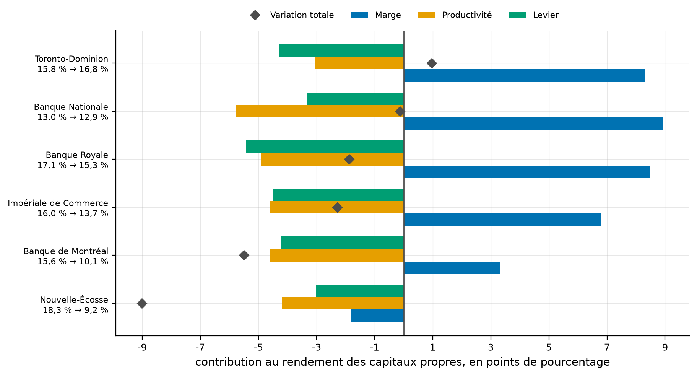
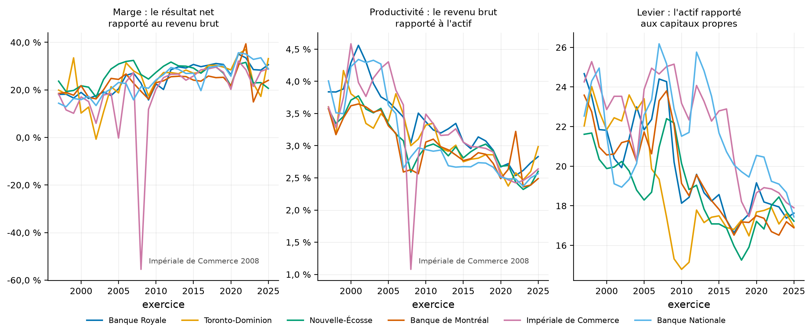
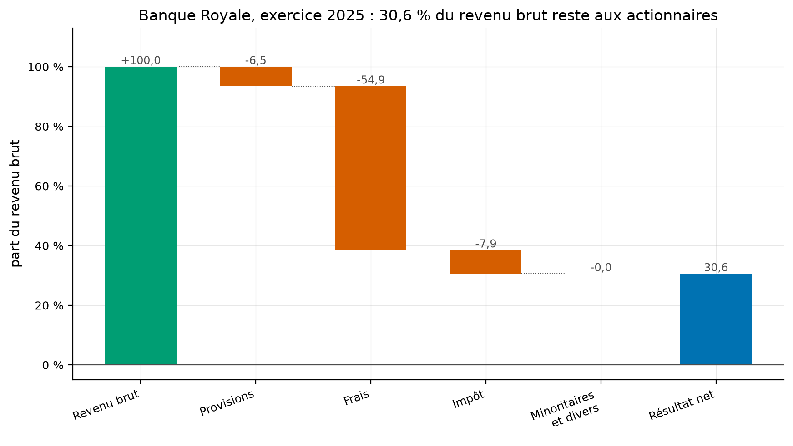
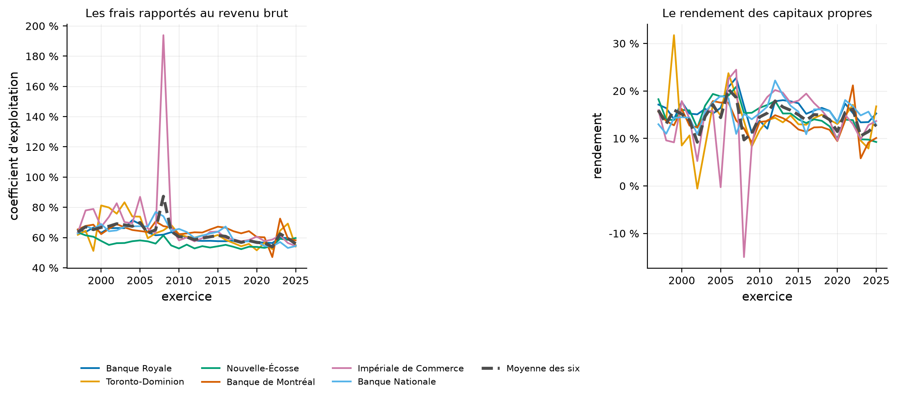
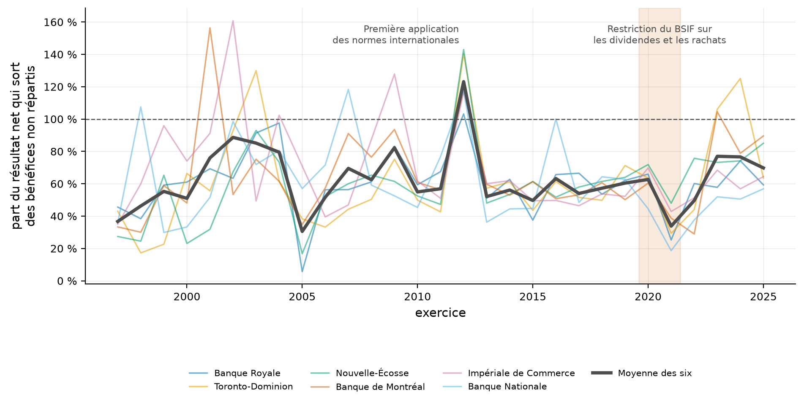

# Les banques canadiennes gagnent mieux leur vie qu'en 1997 et rapportent moins à leurs actionnaires

Une banque qui garde trente cents de chaque dollar encaissé, contre dix-neuf il y a vingt-huit ans,
devrait rapporter davantage. Les six grandes banques canadiennes rapportent pourtant trois points de
moins qu'en 1997. Ce dépôt sépare les causes, sur les relevés que les banques déposent au régulateur.

[](https://github.com/Guilou001/29-rentabilite-des-banques/actions/workflows/ci.yml)


**Résultat en une phrase.** Sur 174 exercices et six banques de 1997 à 2025, la marge a ajouté
**+5,7 points** au rendement des capitaux propres, mais deux choses lui en ont retiré **8,6** : chaque
dollar de bilan produit moins de revenu qu'avant (**−4,5 points**) et les banques portent un tiers de
levier en moins (**−4,1 points**) ; le rendement moyen passe donc de **15,95 % à 12,98 %**, et
l'identité qui le décompose se referme à **5,6 × 10⁻¹⁷**.

*Summary in English. A DuPont decomposition of Canada's six domestic systemically important banks
over 174 bank-years, built from OSFI's public P3 income statement and M4 balance sheet returns
(1.9 million rows). Return on equity fell from 15.95 % to 12.98 % between fiscal 1997 and 2025.
A logarithmic attribution splits the change: margin contributed +5.7 points, asset productivity
−4.5 and leverage −4.1. The three-factor identity closes to machine precision, the revenue-to-net-
income waterfall to one part in a million, and the balance sheet closes exactly on 19 238 of 19 241
month-ends. A by-product: OSFI's income statement carries no dividend line, so what banks return to
shareholders is only visible from retained earnings, where the 2021 fiscal year stands out at 33.8 %
of net income, the year fully covered by OSFI's restriction on dividends and buybacks.*

## 1. La question posée

**En mots simples.** Deux banques rapportent 14 % à leurs actionnaires. La première y arrive parce
qu'elle garde beaucoup de chaque dollar encaissé. La seconde parce qu'elle a emprunté vingt dollars
pour chaque dollar de capitaux propres. Ce n'est pas la même chose : la première tient dans la durée,
la seconde se retourne à la première mauvaise année.

La **décomposition de DuPont**, du nom de l'entreprise chimique qui l'a mise au point vers 1915 pour
arbitrer entre ses divisions, sépare les deux. Elle écrit le rendement des capitaux propres comme un
produit de trois rapports.

> rendement des capitaux propres = marge × productivité de l'actif × levier

La **marge** est ce que la banque garde de chaque dollar encaissé. La **productivité de l'actif** est
le revenu qu'engendre chaque dollar de bilan. Le **levier** est le nombre de dollars de bilan que
porte chaque dollar de capitaux propres. L'égalité est vraie par construction, les dénominateurs
s'annulant deux à deux, ce qui la rend vérifiable à la précision de la machine.

La question est alors précise : sur trente ans, lequel des trois a bougé, et dans quel sens ?

## 2. D'où vient le projet, et ce qu'il apporte

La décomposition de DuPont est enseignée partout et appliquée société par société, le plus souvent
sur trois ou cinq ans de comptes publiés. Le BSIF publie autre chose : le relevé réglementaire que
chaque banque lui dépose, trimestre par trimestre, depuis 1996. C'est la même information comptable,
mais homogène entre les six banques et longue de trente ans, ce qu'aucun rapport annuel n'offre.

Trois apports.

- **Trois identités vérifiées** plutôt qu'un résultat affirmé : celle de DuPont, celle qui descend du
  revenu brut au résultat net, et celle qui referme le bilan, cette dernière sur 19 241 fins de mois.
- **L'attribution logarithmique de la variation du rendement**, qui répartit l'écart entre les trois
  facteurs sans laisser de résidu, sur cinq périodes et six banques.
- **Ce que le compte de résultat du BSIF ne dit pas** : il ne porte aucune ligne de dividendes
  versés, et ce que les banques rendent à leurs actionnaires doit donc se lire au bilan.

## 3. Les données

| Relevé | Ce qu'il porte | Taille | Ce qu'on y prend |
|---|---|---:|---|
| P3 | compte de résultat consolidé, trimestriel | 230 496 088 o | le revenu, les frais, l'impôt, le résultat net |
| M4 | bilan consolidé, mensuel | 748 730 698 o | l'actif total et les cinq lignes de capitaux propres |

Une fois chargés, ils font **1 900 048 lignes**, 110 institutions, 31 exercices de 1996 à 2026.
L'étude porte sur les six banques d'importance systémique nationale et sur les exercices complets,
soit **174 exercices de 1997 à 2025**. Mesuré le 30 août 2026. Licence du gouvernement ouvert du
Canada, usage et redistribution permis avec attribution ; rien n'est redistribué ici.

### Quatre pièges dans les données, mesurés

Le premier est que **le compte de résultat est en cumul annuel**. C'est le seul endroit du
portefeuille où ce cumul simplifie le travail : au quatrième trimestre, le cumul est l'exercice.

Le deuxième est que **la ligne 22 du formulaire n'est pas le revenu brut**. Elle est déjà nette des
provisions pour créances douteuses. Le revenu brut est la somme des lignes 14 et 21, et prendre la 22
sous-estimerait la productivité de six à douze pour cent selon la banque, au dernier exercice.

Le troisième est que **la part des actionnaires minoritaires porte deux codes**. Le premier vient de
l'ancien référentiel comptable canadien, le second des normes internationales, adoptées par les
banques canadiennes à l'exercice 2012. Les deux ne coexistent jamais la même année, et n'en lire
qu'un laisse un trou de plusieurs centaines de millions avant 2012.

Le quatrième est que **deux lignes signées manquent à la descente si on les oublie**. Les activités
abandonnées valent moins 1,8 milliard chez la Banque Royale en 2011, l'exercice où elle a vendu sa
banque de détail américaine ; les éléments extraordinaires valent plus 309 millions chez la
Toronto-Dominion en 2008. Sans elles, la descente laisse un écart de 7,9 % du revenu brut ; avec
elles, de un millionième.

## 4. La méthode, pas à pas

1. **Charger les deux relevés** dans un entrepôt DuckDB, une base analytique qui lit les fichiers sur
   place plutôt que de les tenir en mémoire.
2. **Lire le compte de résultat au quatrième trimestre**, où le cumul est l'exercice entier.
3. **Moyenner le bilan sur les douze mois de l'exercice**, clos le 31 octobre pour les six banques.
   La moyenne, et non la photographie du 31 octobre : un bilan de banque bouge de plusieurs pour cent
   d'un mois à l'autre, et c'est aussi ainsi que les banques calculent leur propre rendement.
4. **Vérifier les trois identités** avant d'interpréter quoi que ce soit.
5. **Décomposer**, puis attribuer la variation par les logarithmes, ce qui rend l'addition exacte
   alors que les trois facteurs se multiplient.

## 5. Les résultats

### 5.1 Les trois identités tiennent

| Identité | Ce qu'elle vérifie | Observations | Pire écart |
|---|---|---:|---:|
| Marge × productivité × levier = rendement | qu'aucun poste n'est compté deux fois | 174 exercices | **5,6 × 10⁻¹⁷** |
| Revenu brut moins charges = résultat net | que la descente est complète | 174 exercices | **8 000 $** sur des milliards |
| Actif = passif plus capitaux propres | que le bilan se referme | 19 241 fins de mois | **1 000 $** |

Comment lire ce tableau, en trois constats. Le premier est que la première ligne est un contrôle du
code et non des données : l'identité de DuPont est vraie par construction, et un écart visible aurait
signalé une erreur de programmation. Le deuxième est que les deux autres portent sur les données
elles-mêmes, et qu'elles tiennent : le bilan des banques canadiennes se referme **exactement** sur
19 238 des 19 241 fins de mois publiées, les trois autres à mille dollars près, ce qui est l'unité de
publication du relevé. Le troisième est que l'écart de 8 000 $ sur la descente n'a été atteint
qu'après avoir trouvé les quatre pièges de la section 3 ; avant, il valait 1,9 milliard.

### 5.2 La marge a gagné, la productivité et le levier ont plus que perdu

Moyenne des six banques, en points de pourcentage de rendement des capitaux propres.

| Période | Rendement au départ | À l'arrivée | Variation | dont marge | dont productivité | dont levier |
|---|---:|---:|---:|---:|---:|---:|
| 1997 à 2007 | 15,95 % | 18,62 % | **+2,67** | +5,37 | −2,52 | −0,19 |
| 2007 à 2009 | 18,62 % | 11,08 % | **−7,54** | −5,51 | −0,86 | −1,17 |
| 2009 à 2019 | 11,08 % | 13,95 % | **+2,87** | +5,92 | −0,60 | −2,45 |
| 2019 à 2025 | 13,95 % | 12,98 % | **−0,97** | −0,30 | −0,66 | −0,01 |
| **1997 à 2025** | **15,95 %** | **12,98 %** | **−2,97** | **+5,67** | **−4,52** | **−4,12** |

Comment lire ce tableau, en trois constats. Le premier est que sur vingt-huit ans la marge a ajouté
5,67 points de rendement, ce qui est considérable, et que le rendement a quand même baissé de 2,97
points : les deux autres facteurs en ont retiré 8,64 à eux deux. Le deuxième est que la crise de 2008
se lit dans la marge et non dans le levier, contrairement à ce qu'on attendrait : entre 2007 et 2009
le levier n'explique que 1,17 point sur 7,54, parce que le désendettement des banques canadiennes est
venu **après** la crise et non pendant, comme le montre la période suivante où le levier retire 2,45
points. Le troisième est que les quatre premières lignes ne s'additionnent pas pour donner la
cinquième : l'attribution est exacte à l'intérieur d'une période, pas entre périodes, et le dépôt
publie donc la période longue comme une ligne à part plutôt que comme une somme.



Comment lire cette figure : trois barres par banque, une par facteur, et un losange pour la variation
totale. Une banque dont le losange est à droite de zéro rapporte plus qu'en 1997. Une seule y arrive.

### 5.3 La Toronto-Dominion est la seule des six à rapporter plus qu'en 1997

| Banque | 1997 | 2025 | Variation | dont marge | dont productivité | dont levier |
|---|---:|---:|---:|---:|---:|---:|
| Toronto-Dominion | 15,80 % | **16,76 %** | **+0,96** | +8,30 | −3,07 | −4,28 |
| Nationale du Canada | 12,98 % | 12,86 % | −0,13 | +8,94 | −5,76 | −3,31 |
| Royale du Canada | 17,13 % | 15,25 % | −1,87 | +8,48 | −4,92 | −5,44 |
| Impériale de Commerce | 15,95 % | 13,67 % | −2,29 | +6,80 | −4,60 | −4,49 |
| de Montréal | 15,60 % | 10,09 % | −5,50 | +3,31 | −4,58 | −4,22 |
| **de Nouvelle-Écosse** | **18,26 %** | **9,25 %** | **−9,01** | **−1,81** | −4,20 | −3,01 |

Comment lire ce tableau, en trois constats. Le premier est que la Banque de Nouvelle-Écosse est la
seule dont la marge a **baissé** en vingt-huit ans, et c'est aussi celle qui perd le plus : elle
partait de la meilleure position des six et finit à la dernière place. Le deuxième est que la Banque
Nationale a la plus forte progression de marge, +8,94 points, et finit pourtant à plat : sa
productivité d'actif a reculé plus que celle de toutes les autres. Le troisième est que la
contribution du levier est du même ordre pour les six, de −3,0 à −5,4 points, ce qui est attendu :
c'est le même régulateur qui a fixé les mêmes exigences de fonds propres aux six.



Comment lire cette figure : un cadre par facteur, une ligne par banque. Le creux nommé du cadre de
gauche est l'exercice 2008 de la Banque Canadienne Impériale de Commerce, dont le revenu brut est
tombé de 12,07 à 3,71 milliards et qui a perdu 2,06 milliards : sa marge vaut cette année-là moins
55 % et son coefficient d'exploitation 194 %. Le cadre de droite montre que le levier ne baisse pas
en 2008 mais à partir de 2009.

### 5.4 De chaque dollar encaissé, trente cents restent aux actionnaires



Comment lire cette figure : la première barre est le revenu brut, ramené à 100. Les trois suivantes
retranchent les provisions pour créances douteuses, les frais de fonctionnement et l'impôt. La
dernière est ce qui reste. Les frais pèsent huit fois plus que les provisions, ce qui explique
pourquoi le premier chiffre qu'un analyste de banque regarde est le coefficient d'exploitation.

| Banque | Rendement 2025 | Marge | Productivité | Levier | Coefficient d'exploitation |
|---|---:|---:|---:|---:|---:|
| Toronto-Dominion | 16,76 % | 33,1 % | 2,99 % | 16,9 | 54,1 % |
| Royale du Canada | 15,25 % | 30,6 % | 2,83 % | 17,6 | 54,9 % |
| Impériale de Commerce | 13,67 % | 28,9 % | 2,64 % | 17,9 | 54,4 % |
| Nationale du Canada | 12,86 % | 28,7 % | 2,57 % | 17,4 | 54,4 % |
| de Montréal | 10,09 % | 24,0 % | 2,49 % | 16,9 | 58,2 % |
| de Nouvelle-Écosse | 9,25 % | 20,6 % | 2,60 % | 17,2 | 59,7 % |

Comment lire ce tableau, en trois constats. Le premier est que le levier ne sépare plus les six : il
va de 16,9 à 17,9, un écart de six pour cent, alors qu'il allait de 21,6 à 24,7 en 1997. Le deuxième
est que le classement suit la marge presque exactement, donc le coefficient d'exploitation : les
quatre banques dont les frais absorbent moins de 55 % du revenu sont les quatre premières. Le
troisième est que l'écart entre la première et la dernière vaut 7,5 points de rendement, soit
davantage que la baisse moyenne du secteur en vingt-huit ans.



Comment lire cette figure : à gauche les frais rapportés au revenu brut, à droite le rendement, avec
la moyenne des six en trait épais. Le coefficient d'exploitation baisse de 63,6 % en 1997 à 55,9 %
en 2025, une amélioration continue, pendant que le rendement, lui, ne monte pas.

### 5.5 Le compte de résultat du BSIF ne porte aucune ligne de dividendes

Ce que les banques rendent à leurs actionnaires ne se lit donc pas directement. Mais les bénéfices
non répartis sont au bilan à chaque fin de mois : ce qui y entre est le résultat de l'exercice, ce
qui en sort est tout le reste.

| Exercice | Part du résultat net qui sort des bénéfices non répartis |
|---|---:|
| 2019 | 60,4 % |
| 2020 | 62,7 % |
| **2021** | **33,8 %** |
| 2022 | 49,6 % |
| 2025 | 69,8 % |
| 2012 | **123,1 %** |

Comment lire ce tableau, en trois constats. Le premier est que l'exercice 2021, qui court de novembre
2020 à octobre 2021, est le plus bas depuis 2005 : il tombe entièrement à l'intérieur de la
restriction du BSIF, qui a demandé aux institutions en mars 2020 de ne pas augmenter leurs dividendes
ni racheter d'actions, et l'a levée le 4 novembre 2021 (source citée en section 8). Le deuxième est
que l'exercice 2012 dépasse cent pour cent, ce qui ne veut pas dire que les banques ont distribué
plus qu'elles n'ont gagné : c'est l'exercice de première application des normes comptables
internationales, dont l'ajustement d'ouverture a été imputé aux bénéfices non répartis. Le troisième
est que ce résidu **n'est pas un taux de distribution** et que le dépôt ne l'appelle pas ainsi : il
mélange les dividendes, les rachats d'actions imputés aux bénéfices non répartis et les retraitements
comptables, et rien dans les relevés publics ne permet de les séparer.



Comment lire cette figure : une ligne fine par banque, la moyenne des six en trait épais, la bande
colorée marquant les exercices couverts par la restriction du BSIF. Le creux de 2021 et le pic de
2012 sont nommés sur la figure parce que sans nom ils passeraient pour du bruit.

## 6. Reproduire

```bash
uv sync --locked --all-extras
uv run pytest                 # 24 tests fermés, sans réseau ni gros fichiers
uv run rdb fetch              # les deux relevés du BSIF, 979 Mo
uv run rdb entrepot           # l'entrepôt DuckDB, 1 900 048 lignes
uv run rdb tout               # les quatre études et les cinq figures
```

Les tests tournent sur les formules et sur une banque fabriquée dont chaque rapport tombe rond. Tous
les chiffres de ce README viennent des fichiers de `results/`.

## 7. Limites, avec leur statut

| Limite | Statut |
|---|---|
| Le résidu des bénéfices non répartis n'est pas un taux de distribution | déclaré ; il mélange dividendes, rachats et retraitements, que rien dans les relevés publics ne sépare |
| L'attribution logarithmique exige un rendement positif aux deux bornes | déclaré ; l'exercice 2008 de la Banque Canadienne Impériale de Commerce est en perte et ne s'y prête pas, et la fonction refuse plutôt que de rendre un nombre |
| Les contributions d'une période ne s'additionnent pas à celles d'une période plus longue | déclaré ; l'attribution est exacte à l'intérieur d'une période, et la période longue est calculée à part |
| Le bilan est moyenné sur douze mois, pas sur les jours | reconnu ; les banques publient elles-mêmes une moyenne, sans dire laquelle, donc l'écart avec leur propre chiffre n'est pas mesurable |
| Les capitaux propres retenus excluent la part des actionnaires minoritaires | déclaré ; c'est ce qui les apparie au résultat net du relevé, lui aussi net de cette part |
| Les changements de référentiel comptable coupent les séries en 2011 et 2012 | mesuré ; les deux codes de minoritaires sont additionnés, mais un retraitement d'ouverture reste un retraitement, et l'exercice 2012 le montre |
| Les six banques seules, pas les banques étrangères ni les petites | déclaré ; l'entrepôt en contient 110, et le code s'applique à n'importe laquelle, mais l'exercice ne se clôt pas toutes en octobre |
| Le rendement calculé ici n'est pas celui que les banques publient | déclaré ; elles retranchent souvent les dividendes privilégiés et emploient les capitaux propres ordinaires, ce qui donne un nombre plus élevé |

## 8. Crédits, licence, citation

Relevés bancaires du portail du gouvernement ouvert du Canada, jeu « Banques » du Bureau du
surintendant des institutions financières, sous licence du gouvernement ouvert, avec attribution.
Formulaires vierges P3 (2023) et M4 (2021) du BSIF, dont la correspondance entre numéro de ligne et
code publié est tirée.

Restriction sur les dividendes et les rachats d'actions : [mesures annoncées par le BSIF en mars
2020](https://www.osfi-bsif.gc.ca/en/news/osfi-announces-measures-support-resilience-financial-institutions)
et [déclaration du surintendant levant ces attentes le 4 novembre
2021](https://www.osfi-bsif.gc.ca/en/news/statement-superintendent-lifting-expectations-dividends-share-repurchases-executive-compensation).

Code sous licence MIT, rapport sous licence CC BY 4.0. Figures et chargeur de données produits par
[gv-fintools](https://github.com/Guilou001/gv-fintools).

Voisinage dans le portefeuille :
[28-etats-financiers-reformules](https://github.com/Guilou001/28-etats-financiers-reformules) fait le
même partage entre exploitation et financement sur les entreprises **non financières** du Canada, où
le levier n'ajoute presque rien ; celui-ci le fait sur les banques, dont le levier est le métier.
[30-risque-operationnel](https://github.com/Guilou001/30-risque-operationnel) lit les mêmes relevés
pour en tirer le capital réglementaire. Le rapport `rapport/rapport.pdf` est engendré depuis ce
README.
